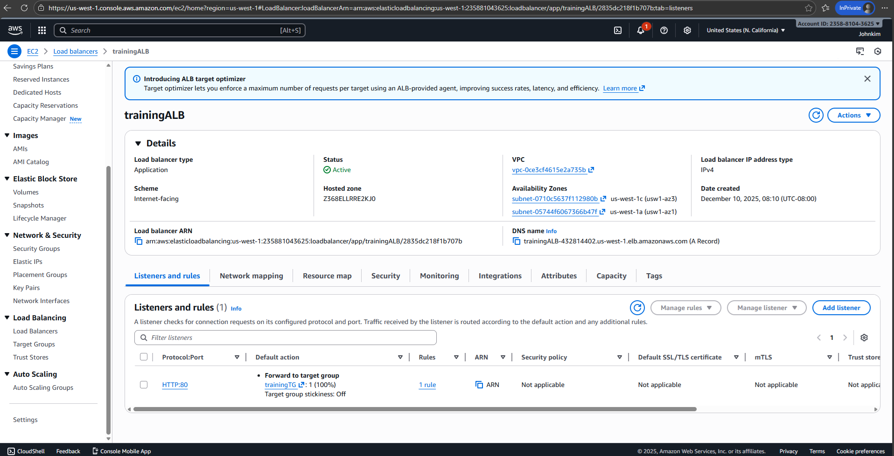
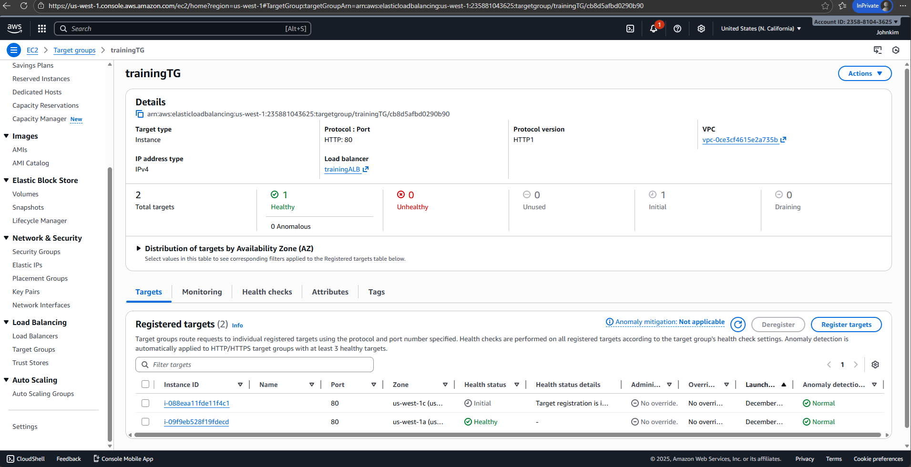
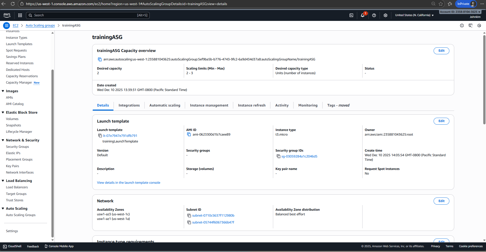
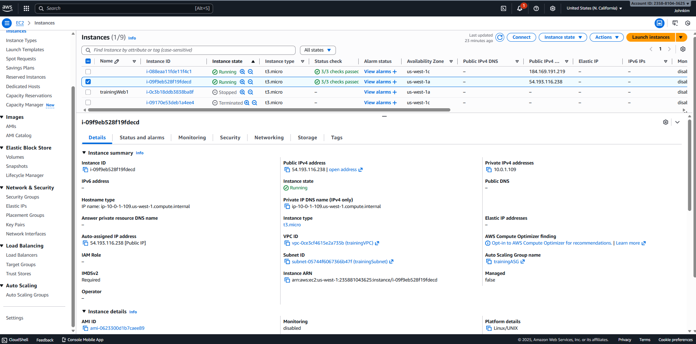

# Project #2 — AWS ALB + Auto Scaling Group (ASG) + 2× EC2 Web Servers

This project deploys a highly available web service using:

- Application Load Balancer (ALB)
- Auto Scaling Group (ASG)
- Two EC2 instances behind the load balancer
- Health checks with automatic self-healing

This pattern is widely used in real Cloud Support / Cloud Engineer roles.

---

## 📌 Architecture Diagram (Text)

Internet  
   |  
[ ALB (HTTP:80, Internet-facing) ]  
   |  
[ Target Group (HTTP:80, Health Check `/`) ]  
   |  
[ Auto Scaling Group (Desired=2, Min=2, Max=3) ]  
   |  
[ EC2 Instance #1 ]     [ EC2 Instance #2 ]

VPC: `trainingVPC`  
Subnets:
- public-subnet-1 (10.0.1.0/24, us-west-1a)  
- public-subnet-2 (10.0.3.0/24, us-west-1c)

---

## 📌 Components Used

| Component | Description |
|----------|-------------|
| VPC | Custom VPC created in Project #1 |
| Public Subnets | Two subnets across different AZs |
| Internet Gateway | Provides outbound internet |
| Route Table | `0.0.0.0/0 → IGW` |
| Application Load Balancer | Distributes traffic |
| Target Group | Tracks EC2 health status |
| Launch Template | EC2 configuration settings |
| Auto Scaling Group | Maintains EC2 fleet |
| Security Groups | ALB SG + EC2 SG |
| User Data | Installs Apache web server |

---

## 📌 ALB Configuration

- Name: `trainingALB`
- Scheme: Internet-facing
- Listener: HTTP:80
- Subnets:
  - public-subnet-1
  - public-subnet-2
- ALB Security Group:
  - Inbound: 80 (0.0.0.0/0)
  - Outbound: ALL

Target Group: `trainingTG`

- Protocol: HTTP 80
- Health Check Path: `/`
- Healthy / Unhealthy thresholds: default

---

## 📌 Launch Template Configuration

- Name: `trainingLaunchTemplate`
- AMI: Amazon Linux 2023
- Instance Type: t2.micro
- Auto-assign Public IP: Enabled
- EC2 Security Group:
  - Inbound: HTTP 80
  - Outbound: ALL
- User Data script:

#!/bin/bash
dnf update -y
dnf install -y httpd
systemctl enable httpd
systemctl start httpd
echo "<h1>Hello from Auto Scaling Group Instance - $(hostname)</h1>" > /var/www/html/index.html

---

## 📌 Auto Scaling Group (ASG)

- Name: `trainingASG`
- Launch Template: latest version
- VPC: trainingVPC
- Subnets:
  - public-subnet-1
  - public-subnet-2
- Desired Capacity: 2  
- Minimum: 2  
- Maximum: 3  
- Health Check Type: EC2 + ELB  
- Target Group: trainingTG  

ASG automatically replaces any EC2 instance that becomes unhealthy.

---

## 📌 How It Works

1. User visits:

   http://<ALB-DNS-Name>

2. ALB receives request on port 80  
3. ALB forwards request to Target Group  
4. Target Group selects a healthy EC2  
5. EC2 serves:

   Hello from Auto Scaling Group Instance - ip-10-0-x-xxx

6. Browser refresh alternates between instance hostnames  
   → confirms ALB load balancing

---

## 📸 Screenshots (place inside `/screenshots` folder)

- project2-alb.png
- project2-target-group.png
- project2-asg.png
- project2-instances.png
- project2-browser.png

Example Markdown references:

### ALB  

### Target Group  

### Auto Scaling Group  

### EC2 Instances  

### Browser Result  

---

## 🧪 Testing

1. Go to EC2 → Load Balancers → trainingALB  
2. Copy DNS name  
3. Open in browser:

   http://trainingALB-xxxxxxxx.us-west-1.elb.amazonaws.com

Expected:

   Hello from Auto Scaling Group Instance - ip-10-0-x-xxx

Refresh several times → hostnames alternate → load balancing OK.

---

## 🛠 Troubleshooting

### ALB shows **502 Bad Gateway**
- Target Group = unhealthy
- Apache not running
- User Data failed
- EC2 has no internet (missing Public IP)

### Targets remain unhealthy
- Health Check Path must be `/`
- EC2 SG must allow port 80
- Apache running?

  systemctl status httpd

### ASG not replacing failed instances
- Health Check Type should include **ELB**
- Desired capacity must be 2

---

## ✅ Result

You now have:

✔ ALB load balancing  
✔ Auto Scaling with self-healing  
✔ Multi-AZ high availability  
✔ Automated EC2 provisioning via user-data  
✔ A complete production-style cloud project for your portfolio
